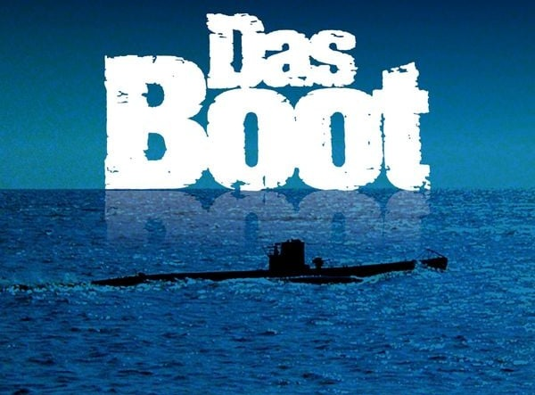

# DAAS Bot

## Discord As A Spreadsheet Bot

This bot achieves a very particular use case: parsing the entire message set of a single channel, then exporting a sqlite database containing the dataset, and uploading that database to the channel.

## Parsed Message Format

```markdown
**<Title>** _<tag>_ <Description>
```

Strictly speaking, the only requirement for a message to match the format is that it begins with some text in markdown-bold markers. This text is the item title.

Following that are zero or more tags in markdown italic markers. These tags can be used to link items together in arbitrary ways.

All remaining text in the message following the final tag is the description. A message must have at least 1 non-whitespace character in the description to match.

## Reactions

All emoji reactions to matched messages are parsed. This lets users vote on items according to a schema of their own devising.

Per Discord, users can select a particular emoji/vote 0 or 1 times per item. They can select an arbitrary number distinct votes per item.

## Output

The output is a sqlite database containing the following tables:

- `items (id, title, description)`
- `tags (id, description)`
- `tag_associations (item_id, tag_id)`
- `users (id, display_name)`
- `categories (id, emoji)`
- `votes (id, item_id, user_id, category_id)`

Nothing is nullable. Ids are numeric. Everything else is text.

## Not This



That is a famous movie.
