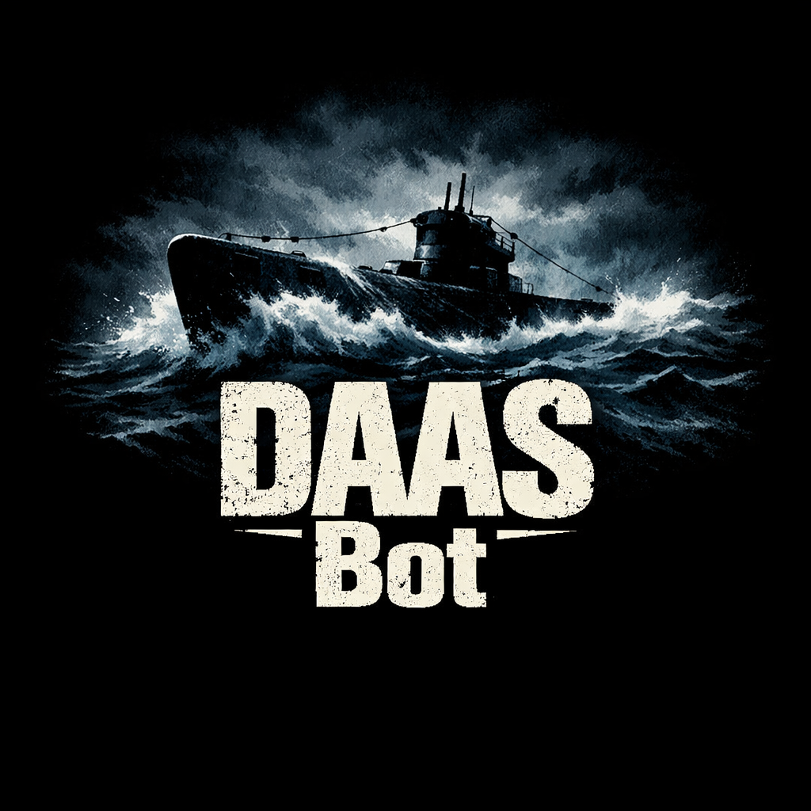

# Discord As A Spreadsheet Bot



This bot achieves a very particular use case: parsing the entire message set of a single channel, then exporting a sqlite database containing the dataset, and uploading that database to the channel.

## Parsed Message Format

```markdown
**<Title>** _<tag>_ <Description>
```

Strictly speaking, the only requirement for a message to match the format is that it begins with some text in markdown-bold markers. This text is the item title.

Following that are zero or more tags in markdown italic markers. These tags can be used to link items together in arbitrary ways.

All remaining text in the message following the final tag is the description. A message must have at least 1 non-whitespace character in the description to match.

## Reactions

All emoji reactions to matched messages are parsed. This lets users vote on items according to a schema of their own devising.

Per Discord, users can select a particular emoji/vote 0 or 1 times per item. They can select an arbitrary number distinct votes per item.

## Output

The output is a sqlite database containing the following tables:

- `items (id, title, description)`
- `tags (id, description)`
- `tag_associations (item_id, tag_id)`
- `users (id, display_name)`
- `categories (id, emoji)`
- `votes (item_id, user_id, category_id)`

Nothing is nullable. Ids are numeric. Everything else is text. (Timestamps are [encoded in ISO-8601](https://sqlite.org/lang_datefunc.html#tmval).)

## Triggers

When first adding this bot to your server, this bot listens globally for two triggers:

- `/daas enable`: registers the current channel as one on which to potentially handle export events
- `/daas disable`: unregisters the current channel as one on which to potentially handle export events

These preceding triggers are only callable by admins.

Once `/daas enable` has been called in at least one channel, any user can then call the export trigger in the enabled channel:

- `/daas export`

### Exporting

The export command performs these steps:

- Constructs a new empty Sqlite database and sets up its schema
- Reads all messages in the channel back to the channel start
- For each [matching message](#parsed-message-format):
  - Writes to the `items`, `tags`, `tag_associations`, and `users` tables
  - Gets all reactions
  - Writes to the `users`, `categories` and `votes` tables
- Posts a message. This message's format is unstable and unspecified, but it will contain at minimum the timestamp of work start, timestamp of work stop, duration of execution, and an attachment with the produced sqlite database.

Note that at no point is any database reused. This allows for schema migrations over time and for external software to track changes in votes over time by comparing different exports.

## Local Debug Config

1. `source .env`: Populates the environment variables with common options and secrets.
1. `cargo run`: Starts the server.
1. (console 2) `cloudflared tunnel --url http://localhost:8080`: Opens a transient tunnel from a random ID to your local server
1. (browser) adjust [bot settings](https://discord.com/developers/applications/1514586560169771129/information) to update interactions endpoint url
1. Test in Discord on any enabled server by running `/daas help` or any other `/daas` command
